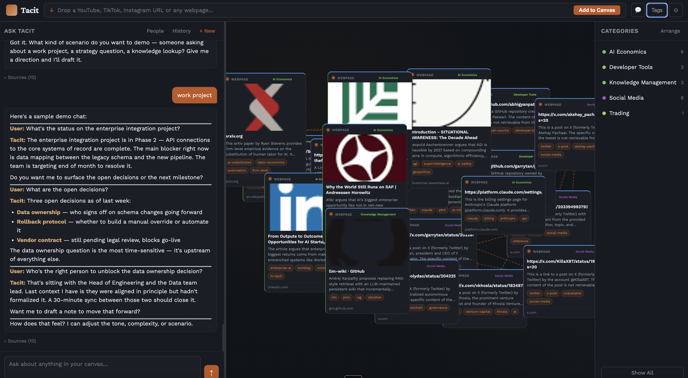

# Tacit — Second Brain

A personal knowledge canvas that captures what you read, remembers who you know, and lets you chat with everything you've saved.

Drop any URL — YouTube, TikTok, Instagram, articles, or any webpage — and Tacit extracts the content, summarizes it, tags it, and places it on a visual canvas. Ask questions about your canvas in natural language. Tacit remembers people you mention and can search the web for anything not already in your knowledge base.



---

## Features

**Canvas**
- Drop any URL to capture content — YouTube videos (with transcripts), TikTok, Instagram, articles, any webpage
- Visual canvas: pan, zoom, drag cards to organise
- Auto-generated semantic connections (edges) between related nodes
- Category sidebar for filtering by topic
- Duplicate detection — won't add the same URL twice

**Chat**
- Ask questions about everything in your canvas
- Full conversation history
- Web search via Claude Haiku for real-time information not in your canvas
- People memory — Tacit tracks people you mention (role, relationship, action items, notes) and recalls them in future conversations

**Under the hood**
- Semantic search via ChromaDB vector embeddings
- Real-time canvas awareness — Tacit sees newly added nodes immediately, including ones still processing
- Claude Sonnet 4.6 for conversation, Claude Haiku 4.5 for web search

---

## Quick Start

### Docker (recommended)

**Requirements:** [Docker Desktop](https://www.docker.com/products/docker-desktop/)

```bash
git clone https://github.com/nik-sobolev/tacit
cd tacit
cp .env.example .env
```

Edit `.env` — set your Anthropic API key and your details:
```
ANTHROPIC_API_KEY=your_key_here
USER_NAME=Your Name
USER_ROLE=Your Role
USER_ORGANIZATION=Your Organization
```

```bash
docker compose up
```

Open **http://localhost:8000** — that's it.

Data (database, uploads, vector index) is stored in `./data/` on your machine and persists across restarts.

---

### Manual install

**Requirements:** Python 3.11+, ffmpeg

```bash
git clone https://github.com/nik-sobolev/tacit
cd tacit
cp .env.example .env   # edit with your API key + details

cd backend
pip install -r requirements.txt
playwright install chromium --with-deps
uvicorn app.main:app --reload --host 127.0.0.1 --port 8000
```

Open **http://127.0.0.1:8000**

---

## Stack

| Layer | Tech |
|-------|------|
| Backend | FastAPI + SQLite + ChromaDB |
| Frontend | Vanilla HTML / CSS / JS |
| AI — conversation | Claude Sonnet 4.6 |
| AI — web search | Claude Haiku 4.5 |
| Embeddings | ChromaDB (local) |
| Storage | SQLite (metadata) + local filesystem |

---

## Project Structure

```
tacit/
├── backend/
│   ├── app/
│   │   ├── api/          # FastAPI route handlers
│   │   ├── core/         # Engine, config, system prompt
│   │   ├── db/           # SQLAlchemy models
│   │   ├── models/       # Pydantic schemas
│   │   └── services/     # Ingestion, graph, vector services
│   └── data/             # SQLite DB + ChromaDB (git-ignored)
└── frontend/
    └── static/           # index.html, app.js, styles.css
```

---

## API

The backend exposes a REST API at `http://localhost:8000/api`:

| Method | Path | Description |
|--------|------|-------------|
| `POST` | `/ingest` | Add a URL to the canvas |
| `GET` | `/graph` | Full canvas graph (nodes + edges) |
| `POST` | `/api/chat` | Send a chat message |
| `GET` | `/conversations` | List conversation history |
| `GET` | `/people` | List remembered people |
| `GET` | `/categories` | Node categories with counts |
| `GET` | `/insights` | Canvas stats and insights |

---

## License

MIT
